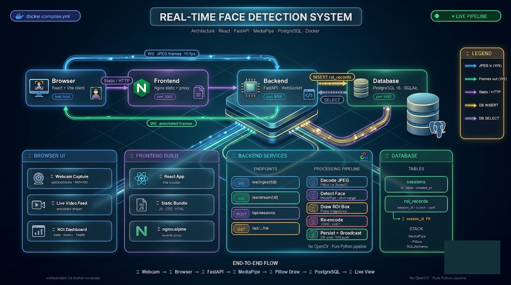

# Real-Time Face Detection Video Streaming System

A containerized end-to-end demo: a React frontend captures webcam frames, ships them
over WebSocket to a FastAPI backend, which detects a face, persists the ROI to
PostgreSQL, draws an axis-aligned bounding box (without OpenCV), and streams the
processed frames back for display.



## Quick start (5 minutes)

**Prerequisites:** Docker Desktop (or Docker Engine + Compose v2) and a webcam.

```bash
git clone <this-repo> face-detection
cd face-detection
cp .env.example .env          # tweak if you like; defaults work
docker compose up --build     # first build pulls ~1 GB of wheels
```

Then open <http://localhost:3000>, click **Start camera**, and grant webcam access.

| Service  | URL                              | Purpose                       |
| -------- | -------------------------------- | ----------------------------- |
| frontend | <http://localhost:3000>          | React UI                      |
| backend  | <http://localhost:8000>          | FastAPI                       |
| API docs | <http://localhost:8000/docs>     | OpenAPI / Swagger             |
| db       | (internal, not published)        | PostgreSQL 16                 |

> **Browser permissions.** `getUserMedia` only works on `localhost` or HTTPS. The defaults
> bind to `localhost:3000`, so this works out of the box.

## The three core endpoints

| #  | Endpoint                                  | Method | Purpose                               |
| -- | ----------------------------------------- | ------ | ------------------------------------- |
| 1  | `/ws/ingest/{session_id}`                 | WS     | Receive video feed (binary JPEG msgs) |
| 2  | `/ws/stream/{session_id}`                 | WS     | Serve processed feed (binary JPEG)    |
| 3  | `/api/sessions/{session_id}/roi`          | GET    | Serve ROI history (JSON, paginated)   |

Plus thin helpers for usability and debugging:

| Endpoint                                      | Method | Purpose                       |
| --------------------------------------------- | ------ | ----------------------------- |
| `/api/sessions`                               | POST   | Create a session              |
| `/api/sessions`                               | GET    | List recent sessions          |
| `/api/sessions/{id}`                          | GET    | Fetch one session             |
| `/api/sessions/{id}/roi/latest`               | GET    | Most recent ROI               |
| `/api/stream/{id}/frame.jpg`                  | GET    | Snapshot of latest frame      |
| `/health`                                     | GET    | Liveness                      |

### Ingest WebSocket contract

* **Client → server:** binary message containing one JPEG-encoded frame.
* **Server → client:** JSON text message:
  ```json
  {
    "frame_index": 42,
    "detection": { "x": 220, "y": 110, "width": 180, "height": 220, "confidence": 0.93 }
  }
  ```
  `detection` is `null` if no face was found in that frame. `error` is set if the frame
  was malformed or oversize; the connection stays open so the client can recover.

## How it works

1. **Capture (browser).** `<video>` plays the webcam stream, a hidden `<canvas>`
   re-encodes each frame as JPEG at ~10 fps.
2. **Ingest.** The `/ws/ingest` handler decodes the JPEG with **Pillow**, runs
   **MediaPipe BlazeFace** on the resulting NumPy array, clamps the bounding box to
   image bounds, draws a green rectangle with **`PIL.ImageDraw`** (zero OpenCV), and
   re-encodes the frame.
3. **Persist.** ROI metadata is inserted into `roi_records` (PostgreSQL).
4. **Fan-out.** The encoded JPEG is published to an in-memory `FrameBus`. Each
   `/ws/stream/{session_id}` subscriber gets it. Slow consumers drop old frames
   rather than backlogging — real-time prefers recency.
5. **Display.** The frontend listens on `/ws/stream`, swaps the `` to a
   blob URL, and renders ROI history in a side panel.

## Why these choices

* **FastAPI** — first-class async + WebSocket support, automatic OpenAPI docs,
  Pydantic validation at the edge.
* **MediaPipe BlazeFace** — Apache-2.0, fast enough for real-time on a laptop CPU,
  and (importantly for this brief) pulls in zero OpenCV dependency at our API layer.
* **Pillow** for drawing — small, ubiquitous, and explicitly *not* OpenCV.
* **PostgreSQL** — the data is naturally relational (one session has many ROIs)
  and we want indexed time-series queries per session. SQLite would do for a toy,
  but the brief asks for "the most appropriate database" and PG fits cleanly.
* **In-memory FrameBus** for live streaming — frames are ephemeral; persisting
  them would be wasteful. For multi-instance deployment this would be swapped
  for Redis pub/sub (the swap is local to one module — see `frame_store.py`).

## Project layout

```
.
├── backend/
│   ├── app/
│   │   ├── main.py            FastAPI app + lifespan + CORS
│   │   ├── config.py          pydantic-settings (env vars)
│   │   ├── routes/
│   │   │   ├── sessions.py    POST/GET sessions
│   │   │   ├── ingest.py      WS receive (endpoint #1)
│   │   │   ├── stream.py      WS serve   (endpoint #2)
│   │   │   └── roi.py         GET ROI    (endpoint #3)
│   │   ├── services/
│   │   │   ├── face_detector.py   MediaPipe wrapper, returns Detection
│   │   │   ├── frame_processor.py decode → detect → draw → encode
│   │   │   └── frame_store.py     in-memory pub/sub
│   │   ├── db/
│   │   │   ├── database.py    engine + Session
│   │   │   └── models.py      SQLAlchemy ORM
│   │   └── schemas.py         Pydantic response models
│   ├── tests/                 pytest (drawer / detector / db / api / bus)
│   ├── requirements.txt
│   ├── pytest.ini
│   └── Dockerfile
├── frontend/
│   ├── src/
│   │   ├── App.jsx            wires WS + REST + webcam
│   │   ├── main.jsx
│   │   ├── index.css
│   │   └── components/{VideoFeed,RoiPanel}.jsx
│   ├── package.json
│   ├── vite.config.js
│   ├── nginx.conf             SPA fallback + security headers
│   └── Dockerfile             multi-stage (node build → nginx serve)
├── docs/architecture.png
├── docker-compose.yml
├── .env.example
└── README.md
```

## Database schema

Two tables, normalized:

```sql
sessions      (id UUID PK, label, started_at, ended_at, frame_count)
roi_records   (id PK, session_id FK CASCADE, frame_index,
               x, y, width, height, confidence, detected_at)
INDEX ix_roi_session_frame (session_id, frame_index)
INDEX ix_roi_session_time  (session_id, detected_at)
```

`ON DELETE CASCADE` keeps history consistent if a session is removed.

## Running tests

```bash
cd backend
python -m venv .venv && source .venv/bin/activate
pip install -r requirements.txt
pytest -q
```

Tests use SQLite in-memory with `PRAGMA foreign_keys = ON` to mirror the
PostgreSQL FK-cascade semantics. The detector test is auto-skipped if MediaPipe
isn't installed locally.

What's covered:

* `test_drawer.py` — image decode/encode, bounding-box drawing, mutation safety, clipping.
* `test_detector.py` — contract of the MediaPipe wrapper; no false positives on blank input.
* `test_db.py` — session/ROI round-trip, FK enforcement, cascade delete.
* `test_frame_bus.py` — pub/sub semantics, slow-consumer back-pressure.
* `test_api.py` — REST endpoints (HTTP semantics, 404s, 422 validation).

## Configuration

All knobs live in `.env` (see `.env.example`):

| Var                | Default                              | Notes                              |
| ------------------ | ------------------------------------ | ---------------------------------- |
| `DATABASE_URL`     | `postgresql+psycopg2://...@db:5432/` | SQLAlchemy URL                     |
| `ALLOWED_ORIGINS`  | `http://localhost:5173,...:3000`     | Comma-separated CORS list          |
| `MAX_FRAME_BYTES`  | `2_000_000`                          | Hard cap per WS message (DoS guard)|
| `VITE_BACKEND_HTTP`| `http://localhost:8000`              | Build-time, baked into the SPA     |
| `VITE_BACKEND_WS`  | `ws://localhost:8000`                | Build-time                         |

## Security baseline

* Backend container runs as a non-root user (UID 1000).
* CORS allow-list is explicit; no wildcard.
* Frame size is bounded; malformed frames are rejected with an error message
  rather than killing the connection.
* DB has no published port; only the backend container can reach it.
* `nginx` adds `X-Content-Type-Options`, `X-Frame-Options`, `Referrer-Policy`.
* No secrets in git — `.env` is gitignored, `.env.example` ships defaults.

This is *baseline*, not production. For a real deployment you'd add: TLS termination,
auth on the WebSocket endpoints, rate limiting, structured logging with redaction,
and Alembic migrations instead of `Base.metadata.create_all`.

## Known limitations / what I'd do next

* Single backend worker keeps the in-memory `FrameBus` consistent. To scale
  horizontally, swap `FrameBus` for Redis pub/sub.
* `Base.metadata.create_all` on startup is fine for a take-home; production
  wants Alembic migrations.
* MediaPipe loads its model on first detector instantiation (~1s). For higher
  fps pipelines the detector should be a long-lived shared resource.
* The frontend assumes one face; matching the brief.
